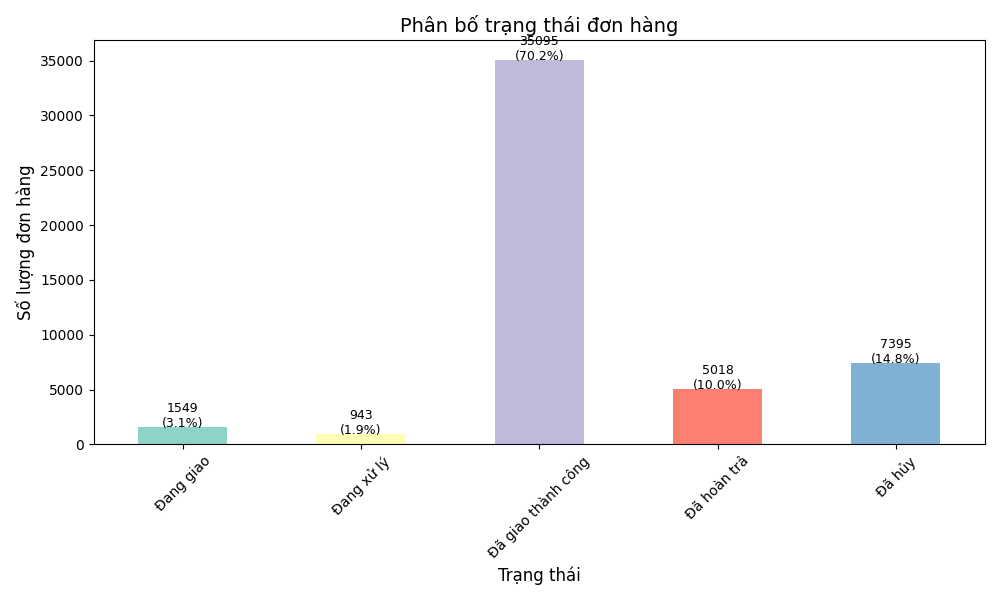
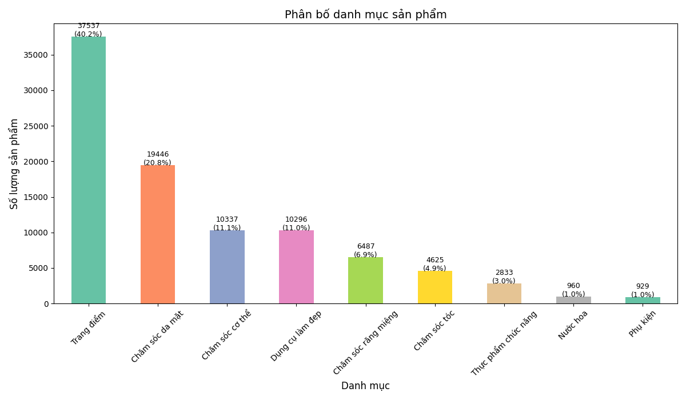
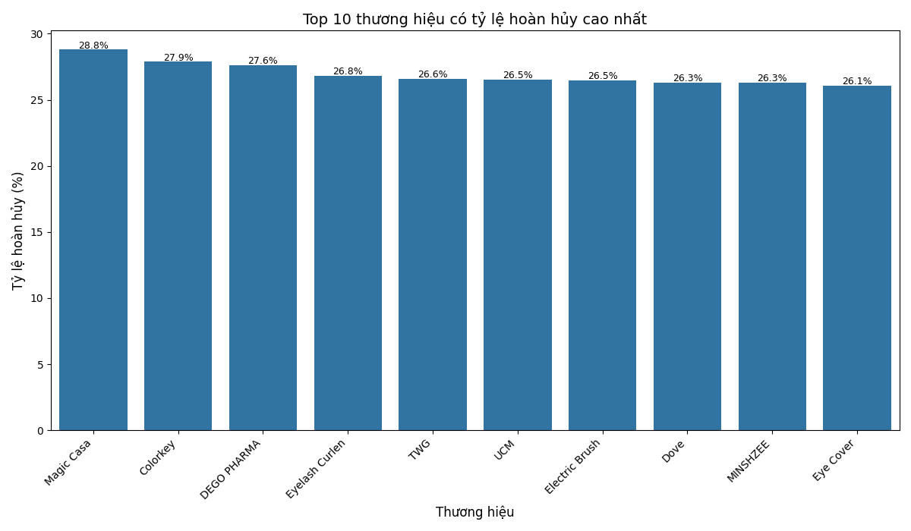
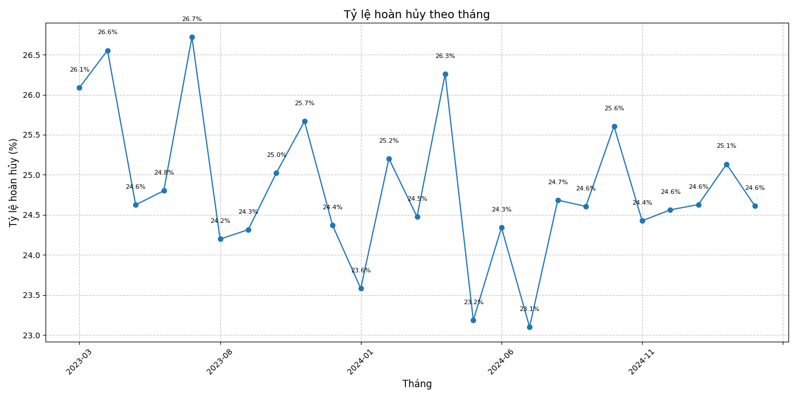
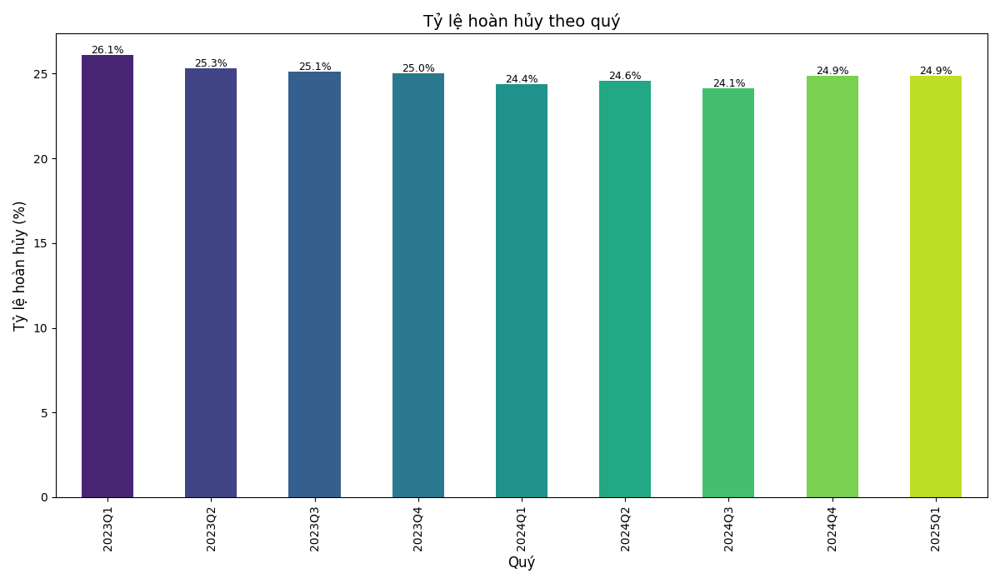
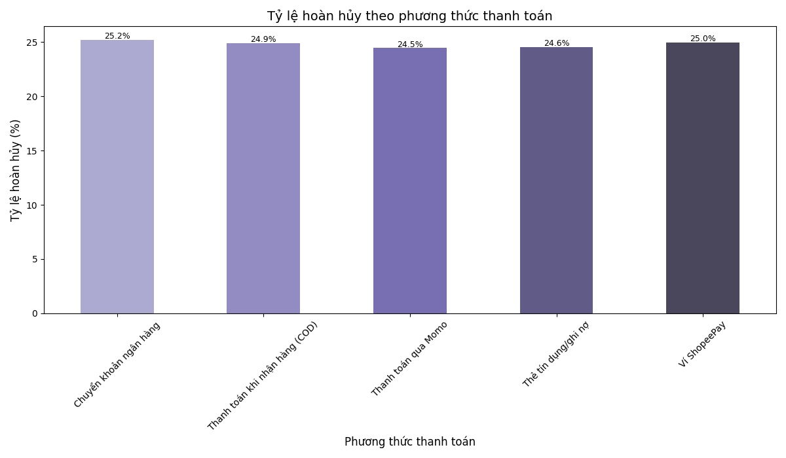
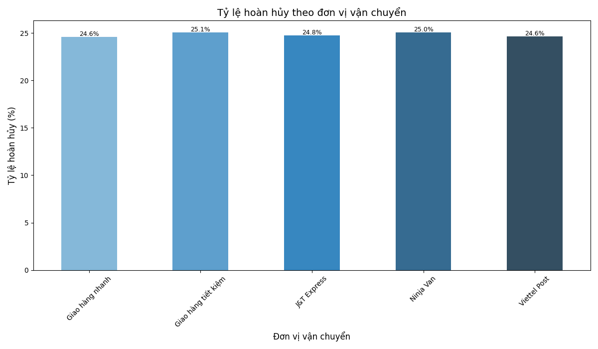

BÁO CÁO PHÂN TÍCH DỮ LIỆU SHOPEE
================================
TỔNG QUAN
---------
Báo cáo này phân tích 50,000 đơn hàng từ dữ liệu Shopee, tập trung vào các chỉ số hoàn hủy và hiệu suất theo nhiều khía cạnh. Dưới đây là những phát hiện chính:
Đã giao thành công: 70.19% (35,095 đơn)
Tỷ lệ đơn hàng hoàn/hủy: 24.83% (12,413 đơn)
Danh mục sản phẩm lớn nhất: Trang điểm (40.17%)

PHÂN TÍCH ĐƠN HÀNG HOÀN HỦY
--------------------------
Tỷ lệ đơn hàng hoàn/hủy chiếm 24.83% tổng số đơn hàng, với các lý do chính:
Tìm được sản phẩm tốt hơn/rẻ hơn (20.58%)
Sản phẩm không phù hợp với làn da (19.37%)
Màu sắc/mùi hương khác với mong đợi (19.20%)

Phân tích theo danh mục cho thấy tỷ lệ hoàn hủy khá đồng đều (~24-25%), với "Chăm sóc răng miệng" có tỷ lệ cao nhất (25.53%).

TOP 10 THƯƠNG HIỆU CÓ TỶ LỆ HOÀN HỦY CAO NHẤT
------------------------------------------
Magic Casa: 28.79%
Colorkey: 27.88%
DEGO PHARMA: 27.63%
Eyelash Curlen: 26.81%
TWG: 26.60%
UCM: 26.53%
Electric Brush: 26.49%
Dove: 26.29%
MINSHZEE: 26.28%
Eye Cover: 26.07%

PHÂN TÍCH THEO KHOẢNG GIÁ
------------------------
Sản phẩm có giá >300k có tỷ lệ hoàn hủy cao nhất (26.26%), trong khi các khoảng giá khác dao động từ 24.61% đến 25.03%.

XU HƯỚNG THEO THỜI GIAN
-----------------------
Tỷ lệ hoàn hủy theo tháng dao động từ 23.10% (thấp nhất vào 2024-07) đến 26.72% (cao nhất vào 2023-07).

Phân tích theo quý:
2023Q1: 26.09% (cao nhất)
2024Q3: 24.12% (thấp nhất)

PHÂN TÍCH THEO GIÁ TRỊ ĐƠN HÀNG
-----------------------------
Đơn hàng có giá trị cao nhất (>1M) có tỷ lệ hoàn hủy cao nhất (26.71%), trong khi đơn hàng <100k có tỷ lệ thấp nhất (24.33%).

PHÂN TÍCH THEO PHƯƠNG THỨC THANH TOÁN
-----------------------------------
Tỷ lệ hoàn hủy cao nhất thuộc về phương thức "Chuyển khoản ngân hàng" (25.23%), thấp nhất là "Thanh toán qua Momo" (24.46%).

PHÂN TÍCH THEO ĐƠN VỊ VẬN CHUYỂN
------------------------------
"Giao hàng tiết kiệm" có tỷ lệ hoàn hủy cao nhất (25.07%), trong khi "Giao hàng nhanh" có tỷ lệ thấp nhất (24.61%).

PHÂN TÍCH SÂU VÀ NHẬN ĐỊNH AI
---------------------------
Từ dữ liệu phân tích, AI xác định một số điểm đáng chú ý:
THỜI VỤ VÀ BIẾN ĐỘNG
Tỷ lệ hoàn hủy có xu hướng tăng cao vào tháng 7/2023 (26.72%) và tháng 4/2024 (26.26%), có thể liên quan đến các đợt khuyến mãi lớn hoặc thay đổi mùa vụ. Ngược lại, các tháng 7/2024 (23.10%) và 5/2024 (23.18%) có tỷ lệ hoàn hủy thấp nhất, cho thấy có cải thiện đáng kể trong giai đoạn này.
VẤN ĐỀ VỀ THÔNG TIN SẢN PHẨM
Ba lý do hàng đầu dẫn đến hoàn hủy đều liên quan đến kỳ vọng của khách hàng không khớp với sản phẩm thực tế:
Tìm được sản phẩm tốt hơn/rẻ hơn (20.58%)
Sản phẩm không phù hợp với làn da (19.37%)
Màu sắc/mùi hương khác với mong đợi (19.20%)
Điều này cho thấy có vấn đề lớn về truyền thông thông tin sản phẩm chưa chính xác hoặc đầy đủ, dẫn đến khách hàng không hài lòng khi nhận được sản phẩm.
MỐI QUAN HỆ GIỮA GIÁ TRỊ ĐƠN HÀNG VÀ TỶ LỆ HOÀN HỦY
Có mối tương quan tích cực giữa giá trị đơn hàng và tỷ lệ hoàn hủy - đơn hàng giá trị càng cao thì tỷ lệ hoàn hủy càng lớn:
<100k: 24.33%
>1M: 26.71%
Điều này gợi ý rằng khách hàng có xu hướng cẩn trọng hơn và yêu cầu cao hơn với các sản phẩm giá trị lớn.
THƯƠNG HIỆU VÀ VẤN ĐỀ CHẤT LƯỢNG
Top 10 thương hiệu có tỷ lệ hoàn hủy cao nhất (từ 26.07% đến 28.79%) đều cao hơn đáng kể so với tỷ lệ trung bình (24.83%). Điều này cho thấy có vấn đề nhất quán về chất lượng hoặc kỳ vọng sản phẩm với các thương hiệu này.
PHƯƠNG THỨC THANH TOÁN VÀ HÀNH VI NGƯỜI DÙNG
Phương thức "Chuyển khoản ngân hàng" có tỷ lệ hoàn hủy cao nhất (25.23%), trong khi "Thanh toán qua Momo" thấp nhất (24.46%). Điều này có thể phản ánh sự khác biệt trong hành vi người dùng theo phương thức thanh toán, với người dùng ví điện tử có thể cẩn thận hơn khi đặt hàng.
KHUYẾN NGHỊ CHIẾN LƯỢC
--------------------
Dựa trên phân tích, AI đề xuất các biện pháp cải thiện sau:
CẢI THIỆN THÔNG TIN SẢN PHẨM
Bổ sung chi tiết hơn về màu sắc, mùi hương thực tế
Thêm đánh giá phù hợp với loại da
Cung cấp so sánh kích thước/dung tích trực quan
CHƯƠNG TRÌNH "THƯƠNG HIỆU ĐÁNG TIN CẬY"
Làm việc với top 10 thương hiệu có tỷ lệ hoàn hủy cao để cải thiện chất lượng
Phát triển tiêu chuẩn chất lượng và cam kết rõ ràng
CHIẾN LƯỢC ỨNG XỬ THEO GIÁ TRỊ
Với đơn hàng >300k: tăng cường thông tin, dịch vụ tư vấn trước mua
Với đơn hàng >1M: cân nhắc chính sách bảo hành/đổi trả đặc biệt
TỐI ƯU HÓA THEO MÙA VỤ
Tăng cường kiểm soát chất lượng vào các tháng cao điểm (tháng 7, tháng 4)
Phân tích sâu hơn các yếu tố thành công trong các tháng có tỷ lệ hoàn hủy thấp
CẢI THIỆN QUY TRÌNH LOGISTIC
Làm việc với "Giao hàng tiết kiệm" để giảm tỷ lệ hoàn hủy
Học hỏi từ quy trình của "Giao hàng nhanh" có tỷ lệ hoàn hủy thấp nhất
KẾT LUẬN
-------
Dữ liệu cho thấy tỷ lệ hoàn hủy đơn hàng ở mức 24.83% là khá cao và nhất quán giữa các danh mục sản phẩm. Tuy nhiên, có những biến động đáng chú ý theo thời gian, thương hiệu, và giá trị đơn hàng. Việc tập trung vào nâng cao chất lượng thông tin sản phẩm và trải nghiệm khách hàng sẽ là chìa khóa để giảm tỷ lệ hoàn hủy và tăng sự hài lòng của người dùng.
Với 70.19% đơn hàng giao thành công, Shopee đang có nền tảng vững chắc để xây dựng chiến lược cải thiện. Bằng cách giải quyết các vấn đề cụ thể được xác định trong báo cáo này, có thể nâng cao tỷ lệ thành công lên 75-80% trong những quý tới.

Điều này gợi ý rằng khách hàng có xu hướng cẩn trọng hơn và yêu cầu cao hơn với các sản phẩm giá trị lớn.

### THƯƠNG HIỆU VÀ VẤN ĐỀ CHẤT LƯỢNG

Top 10 thương hiệu có tỷ lệ hoàn hủy cao nhất (từ 26.07% đến 28.79%) đều cao hơn đáng kể so với tỷ lệ trung bình (24.83%). Điều này cho thấy có vấn đề nhất quán về chất lượng hoặc kỳ vọng sản phẩm với các thương hiệu này.

### PHƯƠNG THỨC THANH TOÁN VÀ HÀNH VI NGƯỜI DÙNG

Phương thức "Chuyển khoản ngân hàng" có tỷ lệ hoàn hủy cao nhất (25.23%), trong khi "Thanh toán qua Momo" thấp nhất (24.46%). Điều này có thể phản ánh sự khác biệt trong hành vi người dùng theo phương thức thanh toán, với người dùng ví điện tử có thể cẩn thận hơn khi đặt hàng.

## KHUYẾN NGHỊ CHIẾN LƯỢC

Dựa trên phân tích, AI đề xuất các biện pháp cải thiện sau:

### CẢI THIỆN THÔNG TIN SẢN PHẨM
- Bổ sung chi tiết hơn về màu sắc, mùi hương thực tế
- Thêm đánh giá phù hợp với loại da
- Cung cấp so sánh kích thước/dung tích trực quan

### CHƯƠNG TRÌNH "THƯƠNG HIỆU ĐÁNG TIN CẬY"
- Làm việc với top 10 thương hiệu có tỷ lệ hoàn hủy cao để cải thiện chất lượng
- Phát triển tiêu chuẩn chất lượng và cam kết rõ ràng

### CHIẾN LƯỢC ỨNG XỬ THEO GIÁ TRỊ
- Với đơn hàng >300k: tăng cường thông tin, dịch vụ tư vấn trước mua
- Với đơn hàng >1M: cân nhắc chính sách bảo hành/đổi trả đặc biệt

### TỐI ƯU HÓA THEO MÙA VỤ
- Tăng cường kiểm soát chất lượng vào các tháng cao điểm (tháng 7, tháng 4)
- Phân tích sâu hơn các yếu tố thành công trong các tháng có tỷ lệ hoàn hủy thấp

### CẢI THIỆN QUY TRÌNH LOGISTIC
- Làm việc với "Giao hàng tiết kiệm" để giảm tỷ lệ hoàn hủy
- Học hỏi từ quy trình của "Giao hàng nhanh" có tỷ lệ hoàn hủy thấp nhất

## KẾT LUẬN

Dữ liệu cho thấy tỷ lệ hoàn hủy đơn hàng ở mức 24.83% là khá cao và nhất quán giữa các danh mục sản phẩm. Tuy nhiên, có những biến động đáng chú ý theo thời gian, thương hiệu, và giá trị đơn hàng. Việc tập trung vào nâng cao chất lượng thông tin sản phẩm và trải nghiệm khách hàng sẽ là chìa khóa để giảm tỷ lệ hoàn hủy và tăng sự hài lòng của người dùng.

Với 70.19% đơn hàng giao thành công, Shopee đang có nền tảng vững chắc để xây dựng chiến lược cải thiện. Bằng cách giải quyết các vấn đề cụ thể được xác định trong báo cáo này, có thể nâng cao tỷ lệ thành công lên 75-80% trong những quý tới.
