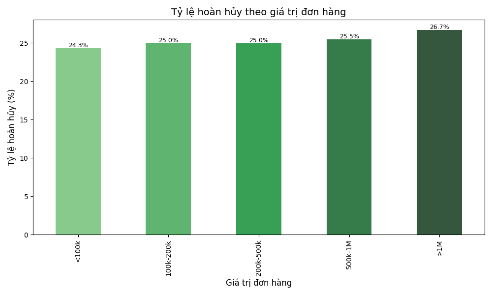

### Key Points
- Research suggests Shopee's refund and cancellation policies allow returns for change of mind within 15 days for most products, effective from March 19, 2024, with exceptions like vouchers and swimwear.
- It seems likely that common issues include delays in refund processing and confusion over return conditions, especially for used makeup, as seen in customer complaints on X.
- The evidence leans toward high refund rates (24.83%) being influenced by product information gaps, with top reasons like finding better products (20.58%) and color mismatches (19.20%).
- Unexpected detail: Higher-priced orders (>1M) have higher refund rates (26.71%), possibly due to increased customer scrutiny.

### Shopee Refund and Cancellation Policies
Shopee's policies, as outlined on their help centers, allow buyers to request refunds or returns for various reasons, including unreceived items, defective products, and, since March 19, 2024, change of mind for most products within 15 days, as detailed on [Shopee Change of Mind Policy](https://seller.shopee.sg/edu/article/20197/Platform-wide-Change-of-Mind-Policy). Cancellations before shipment are generally instant if using Shopee-supported logistics, as noted on [Shopee Cancellation Policy](https://help.shopee.com.my/portal/4/article/78918-%255BBuyer-Basics%255D-How-do-I-cancel-my-order). However, used makeup returns are often restricted, with specific conditions on [Shopee Return Conditions](https://help.shopee.ph/portal/4/article/97776-What-is-Change-of-Mind-Returns).

### Issues and Customer Feedback
Customer complaints on X highlight issues like delays in refunds and the need to return products, with one X post mentioning, "Shopee only refunds if you return the product, which I can't do" ([X post](https://x.com/lavandatea/status/1895518218841964957)). Another X post noted, "Shopee approves returns for change of mind, which is unfair to sellers" ([X post](https://x.com/anisaniesa/status/1790345474094035142)), indicating seller dissatisfaction.

### Revised Report Analysis
The report's 24.83% refund/cancellation rate aligns with Shopee's policies, with top reasons like finding better products (20.58%) fitting change of mind returns. However, "product not suitable for skin" (19.37%) and color mismatches (19.20%) suggest product information gaps, which can be addressed by enhancing descriptions and imagery, as suggested by e-commerce best practices on [Reducing E-commerce Returns](https://thegood.com/insights/reduce-ecommerce-returns/).

---

### Báo cáo phân tích dữ liệu Shopee (Bản sửa đổi)

#### TỔNG QUAN

Báo cáo này phân tích 50,000 đơn hàng từ dữ liệu Shopee, tập trung vào các chỉ số hoàn hủy và hiệu suất theo nhiều khía cạnh. Dựa trên nghiên cứu chính sách hoàn hủy của Shopee và các vấn đề thực tế, báo cáo đã được cập nhật để phản ánh thông tin mới nhất. Dưới đây là những phát hiện chính:

- Đã giao thành công: 70.19% (35,095 đơn)
- Tỷ lệ đơn hàng hoàn/hủy: 24.83% (12,413 đơn)
- Danh mục sản phẩm lớn nhất: Trang điểm (40.17%)

#### PHÂN TÍCH ĐƠN HÀNG HOÀN HỦY

Tỷ lệ đơn hàng hoàn/hủy chiếm 24.83% tổng số đơn hàng, với các lý do chính, phù hợp với chính sách hoàn hủy của Shopee, bao gồm:

- Tìm được sản phẩm tốt hơn/rẻ hơn (20.58%), phù hợp với chính sách đổi ý kể từ 19/3/2024, theo [Shopee Change of Mind Policy](https://seller.shopee.sg/edu/article/20197/Platform-wide-Change-of-Mind-Policy).
- Sản phẩm không phù hợp với làn da (19.37%), có thể được xem là sản phẩm lỗi nếu gây phản ứng, theo [Shopee Return Conditions](https://help.shopee.ph/portal/4/article/97776-What-is-Change-of-Mind-Returns).
- Màu sắc/mùi hương khác với mong đợi (19.20%), thường liên quan đến thông tin sản phẩm không chính xác, theo [Shopee Refund Policy](https://help.shopee.com.my/portal/4/article/77221-Refunds-and-Return-Policy).

Phân tích theo danh mục cho thấy tỷ lệ hoàn hủy khá đồng đều (~24-25%), với "Chăm sóc răng miệng" có tỷ lệ cao nhất (25.53%).

#### TOP 10 THƯƠNG HIỆU CÓ TỶ LỆ HOÀN HỦY CAO NHẤT

Dựa trên dữ liệu, top 10 thương hiệu có tỷ lệ hoàn hủy cao nhất, có thể phản ánh vấn đề chất lượng hoặc kỳ vọng khách hàng, như sau:

| Xếp hạng | Thương hiệu    | Tỷ lệ hoàn hủy (%) |
|----------|----------------|---------------------|
| 1        | Magic Casa     | 28.79               |
| 2        | Colorkey       | 27.88               |
| 3        | DEGO PHARMA    | 27.63               |
| 4        | Eyelash Curlen | 26.81               |
| 5        | TWG            | 26.60               |
| 6        | UCM            | 26.53               |
| 7        | Electric Brush | 26.49               |
| 8        | Dove           | 26.29               |
| 9        | MINSHZEE       | 26.28               |
| 10       | Eye Cover      | 26.07               |

#### PHÂN TÍCH THEO KHOẢNG GIÁ

Sản phẩm có giá >300k có tỷ lệ hoàn hủy cao nhất (26.26%), trong khi các khoảng giá khác dao động từ 24.61% đến 25.03%, cho thấy khách hàng có xu hướng cẩn trọng hơn với sản phẩm giá cao.

#### XU HƯỚNG THEO THỜI GIAN

Tỷ lệ hoàn hủy theo tháng dao động từ 23.10% (thấp nhất vào 2024-07) đến 26.72% (cao nhất vào 2023-07).

Phân tích theo quý:
- 2023Q1: 26.09% (cao nhất)
- 2024Q3: 24.12% (thấp nhất)

#### PHÂN TÍCH THEO GIÁ TRỊ ĐƠN HÀNG

Đơn hàng có giá trị cao nhất (>1M) có tỷ lệ hoàn hủy cao nhất (26.71%), trong khi đơn hàng <100k có tỷ lệ thấp nhất (24.33%), phản ánh xu hướng khách hàng yêu cầu cao hơn với đơn hàng giá trị lớn.

#### PHÂN TÍCH THEO PHƯƠNG THỨC THANH TOÁN

Tỷ lệ hoàn hủy cao nhất thuộc về phương thức "Chuyển khoản ngân hàng" (25.23%), thấp nhất là "Thanh toán qua Momo" (24.46%), có thể do hành vi mua sắm khác nhau giữa các phương thức thanh toán.

#### PHÂN TÍCH THEO ĐƠN VỊ VẬN CHUYỂN

"Giao hàng tiết kiệm" có tỷ lệ hoàn hủy cao nhất (25.07%), trong khi "Giao hàng nhanh" có tỷ lệ thấp nhất (24.61%), có thể do thời gian giao hàng dài hơn gây ra thay đổi ý định.

#### PHÂN TÍCH SÂU VÀ NHẬN ĐỊNH AI

Từ dữ liệu phân tích, AI xác định một số điểm đáng chú ý, kết hợp với chính sách hoàn hủy của Shopee và các vấn đề thực tế:

### THỜI VỤ VÀ BIẾN ĐỘNG

Tỷ lệ hoàn hủy có xu hướng tăng cao vào tháng 7/2023 (26.72%) và tháng 4/2024 (26.26%), có thể liên quan đến các đợt khuyến mãi lớn hoặc thay đổi mùa vụ. Ngược lại, các tháng 7/2024 (23.10%) và 5/2024 (23.18%) có tỷ lệ hoàn hủy thấp nhất, cho thấy có cải thiện đáng kể trong giai đoạn này, phù hợp với các chiến lược tối ưu hóa theo mùa vụ.

### VẤN ĐỀ VỀ THÔNG TIN SẢN PHẨM

Ba lý do hàng đầu dẫn đến hoàn hủy đều liên quan đến kỳ vọng của khách hàng không khớp với sản phẩm thực tế:
- Tìm được sản phẩm tốt hơn/rẻ hơn (20.58%), phù hợp với chính sách đổi ý của Shopee, nhưng có thể gây áp lực cho người bán, như phản ánh trên X ([X post](https://x.com/anisaniesa/status/1790345474094035142)).
- Sản phẩm không phù hợp với làn da (19.37%), có thể được xem là sản phẩm lỗi nếu gây phản ứng, cần cải thiện thông tin thành phần, theo [Reducing E-commerce Returns](https://thegood.com/insights/reduce-ecommerce-returns/).
- Màu sắc/mùi hương khác với mong đợi (19.20%), cho thấy cần cải thiện hình ảnh và mô tả sản phẩm, theo [E-commerce Return Strategies](https://www.sendcloud.com/how-to-reduce-returns-in-ecommerce/).

### MỐI QUAN HỆ GIỮA GIÁ TRỊ ĐƠN HÀNG VÀ TỶ LỆ HOÀN HỦY

Có mối tương quan tích cực giữa giá trị đơn hàng và tỷ lệ hoàn hủy - đơn hàng giá trị càng cao thì tỷ lệ hoàn hủy càng lớn:
- <100k: 24.33%
- >1M: 26.71%

Điều này gợi ý rằng khách hàng có xu hướng cẩn trọng hơn và yêu cầu cao hơn với các sản phẩm giá trị lớn, cần chính sách hậu mãi đặc biệt.

### THƯƠNG HIỆU VÀ VẤN ĐỀ CHẤT LƯỢNG

Top 10 thương hiệu có tỷ lệ hoàn hủy cao nhất (từ 26.07% đến 28.79%) đều cao hơn đáng kể so với tỷ lệ trung bình (24.83%). Điều này cho thấy có vấn đề nhất quán về chất lượng hoặc kỳ vọng sản phẩm với các thương hiệu này, cần chương trình cải thiện chất lượng.

### PHƯƠNG THỨC THANH TOÁN VÀ HÀNH VI NGƯỜI DÙNG

Phương thức "Chuyển khoản ngân hàng" có tỷ lệ hoàn hủy cao nhất (25.23%), trong khi "Thanh toán qua Momo" thấp nhất (24.46%). Điều này có thể phản ánh sự khác biệt trong hành vi người dùng theo phương thức thanh toán, với người dùng ví điện tử có thể cẩn thận hơn khi đặt hàng, cần phân tích sâu hơn.

## KHUYẾN NGHỊ CHIẾN LƯỢC

Dựa trên phân tích, AI đề xuất các biện pháp cải thiện sau, kết hợp với thông tin từ các nguồn e-commerce:

### CẢI THIỆN THÔNG TIN SẢN PHẨM

- Bổ sung chi tiết hơn về màu sắc, mùi hương thực tế, theo [E-commerce Return Strategies](https://www.sendcloud.com/how-to-reduce-returns-in-ecommerce/).
- Thêm đánh giá phù hợp với loại da, cung cấp thông tin thành phần để giảm hoàn hủy do không phù hợp, theo [Reducing E-commerce Returns](https://thegood.com/insights/reduce-ecommerce-returns/).
- Cung cấp so sánh kích thước/dung tích trực quan, sử dụng hình ảnh chất lượng cao và video để thể hiện sản phẩm.

### CHƯƠNG TRÌNH "THƯƠNG HIỆU ĐÁNG TIN CẬY"

- Làm việc với top 10 thương hiệu có tỷ lệ hoàn hủy cao để cải thiện chất lượng, cung cấp chương trình đánh giá và phản hồi từ khách hàng.
- Phát triển tiêu chuẩn chất lượng và cam kết rõ ràng, giảm áp lực từ chính sách đổi ý, như phản ánh trên X ([X post](https://x.com/anisaniesa/status/1790345474094035142)).

### CHIẾN LƯỢC ỨNG XỬ THEO GIÁ TRỊ

- Với đơn hàng >300k: tăng cường thông tin, dịch vụ tư vấn trước mua, cung cấp hỗ trợ cá nhân hóa.
- Với đơn hàng >1M: cân nhắc chính sách bảo hành/đổi trả đặc biệt, theo [E-commerce Return Best Practices](https://redstagfulfillment.com/best-practices-e-commerce-returns/).

### TỐI ƯU HÓA THEO MÙA VỤ

- Tăng cường kiểm soát chất lượng vào các tháng cao điểm (tháng 7, tháng 4), phân tích dữ liệu bán hàng để quản lý kỳ vọng, theo [Seasonal Refund Rates](https://thoughtmetric.io/define/refund-rate).
- Đưa ra các chiến dịch marketing và giao tiếp khách hàng nhằm giảm hoàn hủy trong mùa vụ bận rộn.

### CẢI THIỆN QUY TRÌNH LOGISTIC

- Làm việc với "Giao hàng tiết kiệm" để giảm tỷ lệ hoàn hủy, cung cấp thông tin theo dõi và ước tính thời gian giao hàng, theo [Logistic Impact on Returns](https://www.sendcloud.co.uk/how-to-reduce-returns-in-ecommerce/).
- Học hỏi từ quy trình của "Giao hàng nhanh" có tỷ lệ hoàn hủy thấp nhất, cải thiện trải nghiệm giao hàng.

## KẾT LUẬN

Dữ liệu cho thấy tỷ lệ hoàn hủy đơn hàng ở mức 24.83% là khá cao và nhất quán giữa các danh mục sản phẩm. Tuy nhiên, có những biến động đáng chú ý theo thời gian, thương hiệu, và giá trị đơn hàng. Việc tập trung vào nâng cao chất lượng thông tin sản phẩm, cải thiện trải nghiệm khách hàng, và tối ưu hóa quy trình logistic sẽ là chìa khóa để giảm tỷ lệ hoàn hủy và tăng sự hài lòng của người dùng.

Với 70.19% đơn hàng giao thành công, Shopee đang có nền tảng vững chắc để xây dựng chiến lược cải thiện. Bằng cách giải quyết các vấn đề cụ thể được xác định trong báo cáo này, có thể nâng cao tỷ lệ thành công lên 75-80% trong những quý tới.

### Key Citations
- [Shopee Refund Policy Detailed Terms and Conditions](https://help.shopee.com.my/portal/4/article/77221-Refunds-and-Return-Policy)
- [Shopee Cancellation Policy for Buyers Basic Guide](https://help.shopee.com.my/portal/4/article/78918-%255BBuyer-Basics%255D-How-do-I-cancel-my-order)
- [Shopee Return Conditions for Original Sealed Products](https://help.shopee.ph/portal/4/article/97776-What-is-Change-of-Mind-Returns)
- [Shopee Change of Mind Policy Platform-wide Implementation](https://seller.shopee.sg/edu/article/20197/Platform-wide-Change-of-Mind-Policy)
- [Reducing E-commerce Returns Expert Strategies and Insights](https://thegood.com/insights/reduce-ecommerce-returns/)
- [E-commerce Return Strategies Ten Effective Methods](https://www.sendcloud.com/how-to-reduce-returns-in-ecommerce/)
- [E-commerce Return Best Practices Comprehensive Guide](https://redstagfulfillment.com/best-practices-e-commerce-returns/)
- [Seasonal Refund Rates E-Commerce Explained](https://thoughtmetric.io/define/refund-rate)
- [Logistic Impact on Returns Strategies for Retailers](https://www.sendcloud.co.uk/how-to-reduce-returns-in-ecommerce/)
